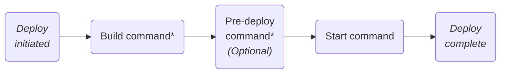

# Deploying on Render — Understand how deploys work.

Render can [automatically deploy](#automatic-deploys) your application each time you merge a change to your codebase:

[image: High-level auto-deploy steps]

You can also trigger [manual deploys](#manual-deploys), both programmatically and in the Render Dashboard.

All service types redeploy with [zero downtime](#zero-downtime-deploys), unless they attach a persistent disk.

You can view your service's deploy history and current live deploy from its *Deploys* page in the [Render Dashboard](https://dashboard.render.com).

## Automatic deploys

As part of creating a service on Render, you link a branch of your Git provider repo (such as `main` or `production`). Whenever you push or merge a change to that branch, by default Render automatically rebuilds and redeploys your service.

Auto-deploys appear on your service's *Deploys* page in the Render Dashboard:

[image: Auto-deploys in the Render Dashboard]

If needed, you can [skip an auto-deploy](#skipping-an-auto-deploy) for a particular commit, or even [disable auto-deploys entirely](#configuring-auto-deploys).

> *Auto-deploys require a connected Git provider.* Services that use a [prebuilt Docker image](/deploying-an-image) or a [public Git repository URL](web-services#deploy-your-own-code) must be deployed [manually](#manual-deploys).

### Configuring auto-deploys

Configure a service's auto-deploy behavior from its *Settings* page in the [Render Dashboard](https://dashboard.render.com):

[image: Configuring auto-deploys in the Render Dashboard]

Under *Auto-Deploy*, select one of the following:

| Option | Description |
| --- | --- |
| *On Commit* | Render triggers a deploy as soon as you push or merge a change to your linked branch. This is the default behavior for a new service. |
| *After CI Checks Pass* | With each change to your linked branch, Render triggers a deploy _only after_ all of your repo's CI checks pass. For details, see [Integrating with CI](#integrating-with-ci). |
| *Off* | Disables auto-deploys for the service. Choose this option if you only want to trigger deploys [manually](#manual-deploys). |

#### Integrating with CI

If you set your service's [auto-deploy behavior](#configuring-auto-deploys) to *After CI Checks Pass*, Render waits for a new commit's CI checks to complete before triggering a deploy. If _all_ checks pass, Render proceeds with the deploy.

For GitHub checks, Render considers a check "passed" if its [conclusion](https://docs.github.com/en/pull-requests/collaborating-with-pull-requests/collaborating-on-repositories-with-code-quality-features/about-status-checks#check-statuses-and-conclusions) is any of `success`, `neutral`, or `skipped`.

> *Render does _not_ trigger a deploy if:*
>
> - Zero checks are detected for the new commit
> - At least one CI check fails for the new commit
>
> If your repo doesn't run CI checks, use *On Commit* instead of *After CI Checks Pass* to enable auto-deploys.

Select the tab for your Git provider to learn which CI checks are supported:

**Tab: GitHub**

Render detects the results of CI checks originating from the following:

- GitHub Actions
- Tools that integrate with the [GitHub checks API](https://docs.github.com/en/rest/guides/using-the-rest-api-to-interact-with-checks), such as [CircleCI](https://circleci.com/docs/enable-checks)

Supported checks appear on commits and pull requests in the GitHub UI:

[image: GitHub checks on a pull request]

**Tab: GitLab**

Render detects the results of jobs executed as part of [GitLab CI/CD pipelines](https://docs.gitlab.com/ci/pipelines/).

**Tab: Bitbucket**

Render detects the results of steps executed as part of [Bitbucket Pipelines](https://support.atlassian.com/bitbucket-cloud/docs/get-started-with-bitbucket-pipelines/).

### Skipping an auto-deploy

Certain changes to your codebase might not require a new deploy, such as edits to a `README` file. In these cases, you can include a *skip phrase* in your Git commit message to prevent the change from triggering an auto-deploy:

```shell
git commit -m "[skip render] Update README"
```

The skip phrase is one of `[skip render]` or `[render skip]`. You can also replace `render` with one of the following:

- `deploy`
- `cd`

When an auto-deploy is skipped, a corresponding entry appears on your service's *Events* page:

[image: A skipped deploy on a service's Events page]

> *For additional control over auto-deploys, configure [*build filters*](monorepo-support#setting-build-filters).*
>
> With build filters, Render triggers an auto-deploy only if there are changes to particular files in your repo (no skip phrase required). [See details](monorepo-support#setting-build-filters).

## Manual deploys

You can manually trigger a Render service deploy in a variety of ways:

**Tab: Dashboard**

From your service's *Deploys* page in the [Render Dashboard](https://dashboard.render.com), open the *Manual Deploy* dropdown:

[image: Manual deploy options in the Render Dashboard]

Select a deploy option:

| Option | Description |
| --- | --- |
| *Deploy latest commit* | Deploys the most recent commit on your service's linked branch. |
| *Deploy a specific commit* | Deploys a specific commit from your service's linked repo. Specify a commit by its SHA, or by selecting it from a list of recent commits. *This disables automatic deploys for the service.* This is because an automatic deploy might reintroduce commits you wanted to exclude from this deploy. Learn more about [deploying a specific commit](#deploying-a-specific-commit). |
| *Clear build cache & deploy* | Similar to *Deploy latest commit*, but first clears the service's build cache. This way, the new deploy doesn't reuse any artifacts generated during a previous build. Use this option to incorporate changes to your service's build command, or to refresh stale static assets. |
| *Restart service* | Deploys the same commit that's _currently_ deployed for the service, with the same values for user-defined environment variables. For details, see [Restarting a service](#restarting-a-service). |

**Tab: CLI**

Run the [Render CLI](cli)'s [`deploys create`](cli-reference#deploys-create) command:

```shell
render deploys create
```

This opens an interactive menu that lists the services in your workspace. Select a service to deploy, then proceed through the prompts.

**Tab: Deploy hook**

Each Render service has a unique *Deploy Hook URL* available on its *Settings page* in the [Render Dashboard](https://dashboard.render.com):

[image: A service's deploy hook URL in the Render Dashboard]

You can trigger a manual deploy by sending an HTTP GET or POST request to this URL. For details, see [Deploy Hooks](/deploy-hooks).

**Tab: API**

Send a `POST` request to the Render API's [Trigger Deploy endpoint](https://api-docs.render.com/reference/create-deploy).

This endpoint accepts optional body parameters for clearing the service's build cache and/or deploying a specific commit. For services that pull a Docker image, you can specify the URL of the image to pull.

### Deploying a specific commit

When deploying manually, you can optionally specify a commit SHA. If you do, Render builds and deploys the specified commit instead of the latest commit from your service's linked branch.

> *If you deploy a specific commit SHA, you should also disable automatic deploys for your service.*
>
> Some deploy methods do this for you automatically. For details, see [Effect on automatic deploys](#effect-on-automatic-deploys).

Learn how to provide a commit SHA using each deploy method:

**Tab: Dashboard**

1. From your service's *Deploys* page in the [Render Dashboard](https://dashboard.render.com), click *Manual Deploy > Deploy a specific commit*:

    [image: Deploying a specific commit in the Render Dashboard]

2. In the dialog that appears, select a commit from the list. You can also paste a commit SHA into the text field.

3. Click *Deploy Commit*. Render immediately kicks off a deploy.

This method disables [automatic deploys](#automatic-deploys) for the service.

**Tab: Deploy hook**

To deploy a specific commit using [deploy hooks](/deploy-hooks), include a `ref` query parameter that specifies the commit SHA to deploy:

```bash
# Full commit SHA
https://api.render.com/deploy/srv-XXYYZZ?key=AABBCC&ref=baaa339926cb474b61c1f0e6297b024eaa09ac7d

# Short commit SHA
https://api.render.com/deploy/srv-XXYYZZ?key=AABBCC&ref=baaa339
```

- As shown, you can provide either a full or short commit SHA.
- This method disables [automatic deploys](#automatic-deploys) for the service.

**Tab: CLI**

After you run [`render deploys create`](cli-reference#deploys-create) and select a service, the Render CLI prompts you for an optional commit ID. Paste the SHA you want to deploy.

In non-interactive environments, you can specify the commit SHA with the `--commit` flag:

```shell
render deploys create srv-abc123 --commit def456
```

Using this method does _not_ disable [automatic deploys](#automatic-deploys) for the service. To disable, follow up with the [`render services update`](cli-reference#services-update) command (set the `--auto-deploy` field to `false`).

**Tab: API**

In your request to the [Trigger Deploy](https://api-docs.render.com/reference/create-deploy) endpoint, include the `commitId` field in the request body:

```json
{
  "commitId": "baaa339926cb474b61c1f0e6297b024eaa09ac7d"
}
```

Using this method does _not_ disable [automatic deploys](#automatic-deploys) for the service. To disable, follow up with a request to the [Update service](https://api-docs.render.com/reference/update-service) endpoint (set the `autoDeploy` field to `no`).

#### Effect on automatic deploys

In almost all cases when you deploy a specific commit for your service, you should also _disable_ [automatic deploys](#automatic-deploys) for it. This is because automatic deploys _always_ use the most recent commit from your service's linked branch, replacing the commit you had just deployed.

Some deploy methods disable automatic deploys for you when you provide a commit SHA:

| Method | Behavior |
| --- | --- |
| *Dashboard* | *Disables* auto-deploys |
| *Deploy hook* | *Disables* auto-deploys |
| *CLI* | *Does not disable* auto-deploys |
| *API* | *Does not disable* auto-deploys |

If you deploy a specific commit with the Render CLI or API, you can disable automatic deploys in the Render Dashboard (see [Configuring auto-deploys](#configuring-auto-deploys)), or with a follow-up action using the same tool (see the [tabs above](#deploying-a-specific-commit)).

If you later reenable automatic deploys for your service, Render once again deploys the most recent commit from your linked branch.

## Deploy steps

With each deploy, Render proceeds through the following commands for your service:



\*Consumes [pipeline minutes](build-pipeline#pipeline-minutes) while running. [View your usage](https://dashboard.render.com/billing#included-usage).

You specify these commands as part of creating your service in the [Render Dashboard](https://dashboard.render.com). You can modify these commands for an existing service from its *Settings* page:

[image: Setting deploy-related commands in the Render Dashboard]

Each command is described below.

*If any command fails or times out, the entire deploy fails.* Any remaining commands do not run. Your service continues running its most recent successful deploy (if any), with [zero downtime](#zero-downtime-deploys).

Command timeouts are as follows:

| Command | Timeout |
| --- | --- |
| Build command | 120 minutes |
| Pre-deploy command | 30 minutes |
| Start command | 15 minutes |

### Build command

Performs all compilation and dependency installation that's necessary for your service to run. It usually resembles the command you use to build your project locally.

> *This command consumes pipeline minutes while running.*
>
> You receive an included amount of pipeline minutes each month and can purchase more as needed. [View your usage](https://dashboard.render.com/billing#included-usage).

#### Example build commands for each runtime

------

##### Node.js

`npm install` / `pnpm install` / `bun install`

`yarn`

##### Python

`pip install -r requirements.txt`

`poetry install`

`uv sync`

> To use `uv`, a `uv.lock` file must be present in your service's root directory. [Learn more](uv-version).

##### Ruby

`bundle install`

##### Go

`go build -tags netgo -ldflags '-s -w' -o app`

##### Rust

`cargo build --release`

##### Elixir

`mix deps.get --only prod && mix compile`

`mix deps.get --only prod && mix assets.deploy`

##### Docker

*You can't set a build command for services that use Docker.*

Instead, Render either:

- [Builds a custom image](docker#building-from-a-dockerfile) based on your Dockerfile
- [Pulls a specified image](/deploying-an-image) from your container registry

------

### Pre-deploy command

If defined, the pre-deploy command runs _after_ your service's build finishes, but _before_ that build is deployed. Recommended for tasks that should always precede a deploy but are _not_ tied to building your code, such as:

- Database migrations
- Uploading assets to a CDN

> *The pre-deploy command executes on a separate instance from your running service.*
>
> Changes you make to the filesystem are _not_ reflected in the deployed service. You do not have access to a service's attached persistent disk (if it has one).

The pre-deploy command is available for paid web services, private services, and background workers.

If you _don't_ define a pre-deploy command for a service, Render proceeds directly from the [build command](#build-command) to the [start command](#start-command).

> *This command consumes pipeline minutes while running.*
>
> You receive an included amount of pipeline minutes each month and can purchase more as needed. [View your usage](https://dashboard.render.com/billing#included-usage).

### Start command

Render runs this command to start your service when it's ready to deploy.

#### Example start commands for each runtime

------

##### Node.js

`npm start` / `pnpm start` / `bun run start`

`yarn start`

`node index.js`

##### Python

`gunicorn your_application.wsgi`

##### Ruby

`bundle exec puma`

##### Go

`./app`

##### Rust

`cargo run --release`

##### Elixir

`mix phx.server`

`mix run --no-halt`

##### Docker

By default, Render runs the `CMD` defined in your Dockerfile. You can specify a different command in the *Docker Command* field on your service's *Settings* page.

> *To run multiple commands with Docker, provide those commands to `/bin/bash -c`.*
>
> For example, here's a Docker Command for a Django service that runs database migrations and then starts the web server:
>
> ```
/bin/bash -c python manage.py migrate && gunicorn myapp.wsgi:application --bind 0.0.0.0:10000
```

------

## Managing deploys

### Handling overlapping deploys

Only one deploy can run at a time per service. Sometimes, a deploy will trigger while _another_ deploy is still in progress. When this occurs, your service can do one of the following:

------

###### Policy

**Wait**

###### Description

Allow the in-progress deploy to finish, then proceed directly to the most recently triggered deploy:

[image: A deploy waiting for an in-progress deploy to complete]

- In this case, Render skips any "intermediate" deploys, such as Deploy B in the timeline above.
- We recommend this option for most workspaces, because it helps maintain a regular cadence of deploys during periods of high change volume.
- This is the default policy for workspaces created *on or after 2025-07-14*.

---

###### Policy

**Override**

###### Description

Immediately cancel the in-progress deploy and start the new one.

- This is the default policy for workspaces created *before 2025-07-14*.

------

You can set which of these policies to use for your workspace:

1. In the [Render Dashboard](https://dashboard.render.com), open your workspace's *Settings* page.
2. Scroll down to the *Overlapping Deploy Policy* section and click *Edit*:

   [image: The Overlapping Deploy Policy setting in the Render Dashboard]

3. Select an option and click *Save changes*.

### Canceling a deploy

You can cancel an in-progress deploy in the [Render Dashboard](https://dashboard.render.com) by going to your service's *Deploys* page and clicking *Cancel deploy*:

   [image: Canceling a deploy in the Render Dashboard]

If you cancel an in-progress deploy while another deploy is [waiting](#handling-overlapping-deploys), Render immediately kicks off the waiting deploy.

### Restarting a service

If your service is misbehaving, you can restart it from your service's *Deploys* page in the [Render Dashboard](https://dashboard.render.com). Click *Manual Deploy > Restart service*:

[image: Restarting a service in the Render Dashboard]

On Render, a service restart is actually a special form of [manual deploy](#manual-deploys):

- Like any other deploy, Render creates a completely new instance of your service and swaps over to it when it's ready.
  - This makes restarting a [zero-downtime action](#zero-downtime-deploys).
  - If your service is [scaled](scaling) to multiple instances, a restart applies to all instances.
- _Unlike_ other deploys, the new instance always uses the exact same Git commit and configuration as the running instance at the time of the restart.
  - This means that if you've recently updated your service's environment variables but haven't redeployed since then, restarting does _not_ incorporate those changes.

### Rolling back a deploy

See [Rollbacks](rollbacks).

## Deployment concepts

### Ephemeral filesystem

By default, Render services have an *ephemeral filesystem*. This means that any changes a running service makes to its filesystem are _lost_ with each deploy.

To persist data across deploys, do one of the following:

- Create and connect to a Render-managed datastore (Render [Postgres](postgresql) or [Key Value](key-value)).
- Create and connect to a custom datastore, such as [MySQL](/deploy-mysql) or [MongoDB](/deploy-mongodb).
- Attach a [persistent disk](disks) to your service.
  - Note the [limitations of persistent disks](disks#disk-limitations-and-considerations).

### Zero-downtime deploys

Whenever you deploy a new version of your service, Render performs a sequence of steps to make sure the service stays up and available throughout the deploy process, even if the deploy fails.

This *zero-downtime deploy* sequence applies to web services, private services, background workers, and cron jobs. Static sites _also_ update with zero downtime, but they're backed by a CDN and don't involve service instances. [Learn more about service types](service-types#summary-of-service-types).

> Adding a persistent disk to your service _disables_ zero-downtime deploys for it. [See details](disks#disk-limitations-and-considerations).

#### Sequence of events

1. When you push up a new version of your code, Render attempts to build it.

   - If the build fails, Render cancels the deploy, and your original service instance continues running without interruption.

2. If the build succeeds, Render attempts to spin up a _new_ instance of your service running the new version of your code.

   - *For web services and private services,* your _original_ instance continues to receive all incoming traffic while the new instance is spinning up:

   ```mermaid
   flowchart LR
     lb{{"Render<br/>load balancer"}};
     subgraph " ";
       direction LR;
       instance1("Original instance<br/>(v1)");
       instance2("<strong>New instance<br/>(v2)</strong>");
       class instance2 success;
     end;
     lb edge1@--> instance1;
     edge1@{animation: slow}
     lb ~~~ instance2;
   ```

3. If the new instance spins up successfully (for web services, you can help verify this by setting up [health checks](health-checks)), Render updates your current deployed commit accordingly.

   - *For web services and private services,* Render also updates its networking configuration so that your _new_ instance begins receiving all incoming traffic:

   ```mermaid
   flowchart LR
     lb{{"Render<br/>load balancer"}};
     subgraph " ";
       direction LR;
       instance1("Original instance<br/>(v1)");
       instance2("New instance<br/>(v2)");
       class instance1 secondary;
     end;
     lb ~~~ instance1;
     lb edge1@--> instance2;
     edge1@{animation: slow}
   ```

4. After 60 seconds, Render sends a `SIGTERM` signal to your app's process on the _original_ instance.
   - This signals your app to perform a [graceful shutdown](#graceful-shutdown).
5. If your app's process doesn't exit within its specified *shutdown delay* (default 30 seconds), Render sends a `SIGKILL` signal to force the process to terminate.

   - You can extend your service's shutdown delay. [See details](#setting-a-shutdown-delay).

     ```mermaid
     flowchart LR
       lb{{"Render<br/>load balancer"}};
       subgraph " ";
         direction LR;
         instance1("<s>Original instance<br/>(v1)</s>");
         instance2("New instance<br/>(v2)");
         class instance1 failure;
       end;
       lb ~~~ instance1;
       lb edge1@--> instance2;
       edge1@{animation: slow}
     ```

6. For web services with [edge caching](web-service-caching) enabled, Render purges all of the service's cache entries.

   - This helps ensure that clients receive up-to-date content. [See details](web-service-caching#invalidation-and-expiration).

7. The zero-downtime deploy is complete.

*For services that are [scaled](scaling) to multiple instances,* Render performs steps 2-5 for one instance at a time. If _any_ new instance fails to become healthy during this process, Render cancels the entire deploy and reverts to instances running the previous version of your service.

### Graceful shutdown

As part of deploying your service to a new instance, Render triggers a shutdown of the _current_ instance by sending your application a `SIGTERM` signal. Your application should define logic to perform a graceful shutdown in response to this signal.

Common shutdown actions include:

- Responding to remaining in-flight HTTP requests
- Completing in-progress worker tasks (or marking them as failed so they're retried by other workers)
- Terminating outbound connections to external services
- Exiting with a zero status after other cleanup actions are complete

If your service is still running after its configured *shutdown delay* (default 30 seconds), Render sends your application a `SIGKILL` signal. This terminates the application immediately with a non-zero status.

#### Setting a shutdown delay

If your service needs more than 30 seconds to complete a graceful shutdown, you can specify a longer shutdown delay (up to a maximum of 300 seconds) in one of the following ways:

- Call the Render API's [Update service](https://api-docs.render.com/reference/update-service) endpoint and set the `maxShutdownDelaySeconds` field to the desired value.
- Add the [`maxShutdownDelaySeconds`](blueprint-spec#maxshutdowndelayseconds) field to your service's associated `render.yaml` configuration.
  - Use this method if you manage your service with a [Blueprint](infrastructure-as-code).

> *Need more than 300 seconds for graceful shutdown?*
>
> Reach out to our support team in the [Render Dashboard](https://dashboard.render.com?contact-support).


---

##### Appendix: Glossary definitions

###### service type

When you deploy code on Render, you select a *service type* based on the capabilities you need.

For example, you create a *web service* to host a dynamic web app at a public URL.

Related article: https://render.com/docs/service-types.md

###### persistent disk

A high-performance SSD that you can attach to a service to preserve filesystem changes across deploys and restarts.

Disables [zero-downtime deploys](/deploys#zero-downtime-deploys) for the service.

Related article: https://render.com/docs/disks.md

###### Git provider

Render integrates with:

- GitHub
- GitLab
- Bitbucket
- Cursor Origin (beta)

Related article: https://render.com/docs/git-provider.md

###### build command

The command that Render runs to build your service from source.

Common examples include `npm install` for Node.js and `pip install -r requirements.txt` for Python.

Related article: https://render.com/docs/deploys.md#build-command

###### pre-deploy command

If set for a service, Render runs this command just before each of its deploys.

Ideal for database migrations and other tasks that should always precede service startup.

Related article: https://render.com/docs/deploys.md#pre-deploy-command

###### start command

The command that Render runs to start your built service in a newly deployed *instance*.

Common examples include `npm start` for Node.js and `gunicorn your_application.wsgi` for Python.

Related article: https://render.com/docs/deploys.md#start-command

###### pipeline minutes

The amount of time Render spends running *build commands* and *pre-deploy commands* for your services.

Your workspace receives a monthly included amount of pipeline minutes. If you exceed this amount, Render bills you for a supplementary amount.

Related article: https://render.com/docs/build-pipeline.md

###### web service

Deploy this *service type* to host a dynamic application at a public URL.

Ideal for full-stack web apps and API servers.

Related article: https://render.com/docs/web-services.md

###### private service

Deploy this *service type* to host a dynamic application that is not internet-reachable.

Ideal for internal apps that only your other Render services can access.

Related article: https://render.com/docs/private-services.md

###### background worker

Deploy this *service type* to continuously run code that does not receive incoming requests.

Ideal for processing jobs from a queue.

Related article: https://render.com/docs/background-workers.md
