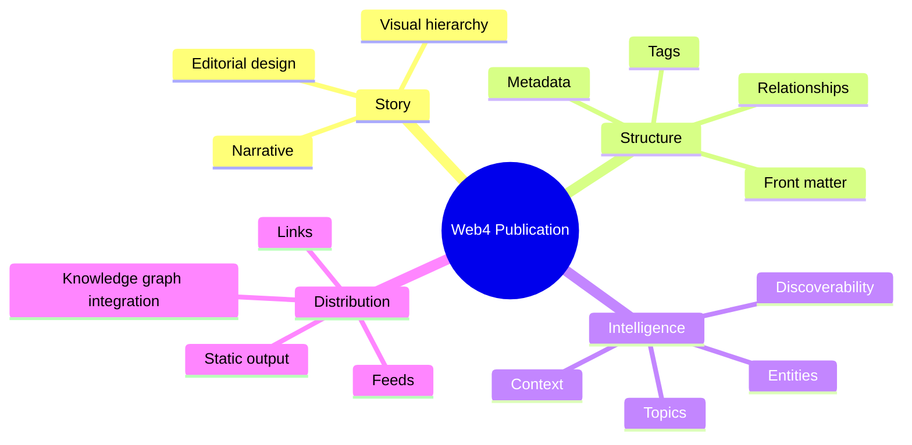
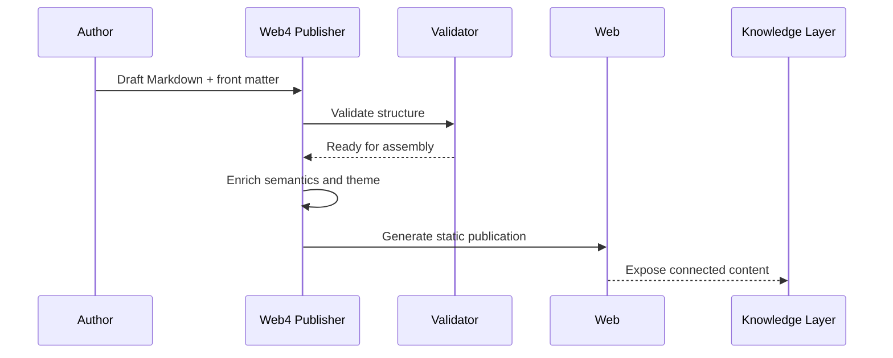

<div align="center">

# Web4 Publisher

### Semantic-first publishing for the next knowledge layer.

Turn ideas into beautiful, structured, and discoverable publications that feel native to the open web.

[**Explore the platform**](#platform) · [**See the workflow**](#workflow) · [**Build with it**](#get-started)

</div>

<picture>
  <source media="(prefers-color-scheme: dark)" srcset="https://images.unsplash.com/photo-1498050108023-c5249f4df085?auto=format&fit=crop&w=1800&q=80">
  <source media="(prefers-color-scheme: light)" srcset="https://images.unsplash.com/photo-1498050108023-c5249f4df085?auto=format&fit=crop&w=1800&q=80">
  
</picture>

> Web4 Publisher is a publishing engine for authors, communities, and builders who want content that is not just readable, but meaningful, searchable, and networked.

## Platform

Web4 Publisher gives teams a modern foundation for publishing content that is clear to people and machine-readable to the systems around it.

It blends clean editorial workflows with semantic structure, making every article more than a static page.

<div align="center">

| 🧠 Semantic | ✍️ Editorial | 🌐 Distributed |
|:---:|:---:|:---:|
| Meaning-rich metadata | Author in Markdown/MDX | Publish with static-first delivery |
| Searchable context | Theme-ready layouts | Connect ideas across systems |

</div>

### Built for modern publishing

- Structured front matter and metadata
- Markdown-first authoring with room for rich media
- Themeable experiences for publication, storytelling, and docs
- Semantic tagging for topic discovery and networked knowledge
- Designed to work beautifully on static hosting and modern web stacks

## Workflow


## A publication should carry meaning



## Why teams choose it

### 1. Editorial elegance

Create thoughtful, high-quality publication experiences with clean structure and visual clarity.

### 2. Semantic depth

Every article can carry meaningful metadata, context, and relationships instead of living as isolated text.

### 3. Open compatibility

Built around Markdown, MDX, and static-first publishing patterns that are portable, readable, and easy to extend.

### 4. Built for connection

Content becomes easier to index, cross-link, and embed into broader knowledge ecosystems.

## Publication model



## What a publication can become

| Capability | Outcome |
| --- | --- |
| **Knowledge architecture** | Articles carry context, not just content. |
| **Design system** | Publications feel distinct and premium. |
| **Open content** | Markdown-first authoring remains portable and reusable. |
| **Machine-readable structure** | Better indexing, discovery, and semantic linking. |
| **Web4-native framing** | Ideas become networked, contextual, and shareable. |

## Get started

Start with a simple publication definition:

```yaml
---
title: "My Web4 Publication"
description: "A structured idea ready to be shared."
author: "Your Name"
tags:
  - web4
  - knowledge
  - publishing
draft: false
---
```

Then add the story, media, references, and diagrams that make the idea valuable and understandable.

## Roadmap

- [ ] Publication schema and validation
- [ ] Markdown and MDX rendering pipeline
- [ ] Premium visual themes
- [ ] Semantic enrichment and indexing
- [ ] Entity and relationship modeling
- [ ] Static deployment and distribution tooling

## Build the next layer of publishing

Web4 Publisher is designed for creators, researchers, communities, and teams who want to move beyond static content and build lasting digital knowledge.

<div align="center">

**Publish with meaning. Design with clarity. Connect with the web.**

</div>
