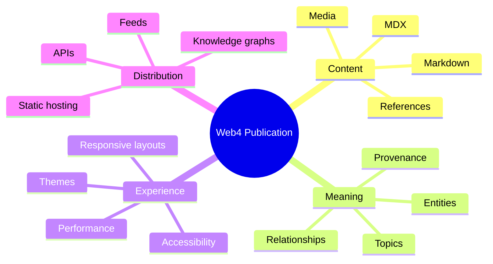
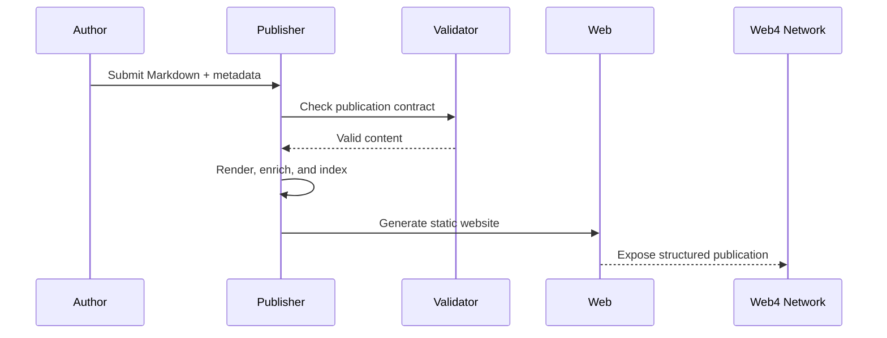

<div align="center">

# Web4 Publisher

### Publish ideas as structured, discoverable knowledge.

A semantic-first publishing engine for building beautiful, connected, and machine-readable Web4 publications.

[**Explore the vision →**](#the-web4-publishing-vision) · [**See the workflow →**](#how-it-works) · [**Start building →**](#get-started)

</div>

<picture>
  <source media="(prefers-color-scheme: dark)" srcset="https://images.unsplash.com/photo-1635070041078-e363dbe005cb?auto=format&fit=crop&w=1800&q=85">
  <source media="(prefers-color-scheme: light)" srcset="https://images.unsplash.com/photo-1635070041078-e363dbe005cb?auto=format&fit=crop&w=1800&q=85">
  
</picture>

> **Web4 Publisher** turns content into a living knowledge layer: readable by people, understandable by machines, and ready to connect with the wider Web4 ecosystem.

## The Web4 publishing vision

Traditional publishing focuses on getting words onto a page. Web4 publishing adds meaning, context, and relationships.

With Web4 Publisher, every article can become:

- **Beautiful** — presented through responsive, themeable layouts.
- **Semantic** — enriched with structured metadata and meaningful tags.
- **Discoverable** — organized for search, indexing, and knowledge graphs.
- **Portable** — built from open Markdown and designed for static delivery.
- **Connected** — ready to link people, concepts, publications, and communities.

## How it works

```mermaid
flowchart LR
    A[Write in Markdown or MDX] --> B[Validate front matter]
    B --> C[Parse content]
    C --> D[Enrich semantic metadata]
    D --> E[Build themed publication]
    E --> F[Publish static output]
    F --> G[Connect to the Web4 knowledge layer]

    classDef input fill:#172554,stroke:#60a5fa,color:#fff
    classDef process fill:#312e81,stroke:#a78bfa,color:#fff
    classDef output fill:#064e3b,stroke:#34d399,color:#fff

    class A input
    class B,C,D,E process
    class F,G output
```



## A publication is more than a page



## Built for the open web

| Capability | What it means |
| --- | --- |
| **Markdown-first** | Write with familiar, portable formats. |
| **Semantic metadata** | Add context that software can understand. |
| **Static-first delivery** | Fast, secure, and easy to deploy anywhere. |
| **Themeable presentation** | Give every publication a distinctive visual identity. |
| **Open asset support** | Include images, diagrams, video, and external references. |
| **Composable architecture** | Extend the pipeline without locking content into one platform. |

## A simple publication model



## Designed for creators and communities

<div align="center">

| ✍️ Create | 🧠 Enrich | 🌐 Connect |
|:---:|:---:|:---:|
| Focus on the idea | Add machine-readable meaning | Share it across the open web |

</div>

Whether you are publishing research, community knowledge, project documentation, or a new Web4 protocol, the goal is the same: make important ideas easy to read, reuse, and connect.

## Get started

Create a publication with front matter and Markdown:

```yaml
---
title: "My Web4 Publication"
description: "A structured idea ready to be shared."
author: "Your Name"
tags:
  - web4
  - knowledge
  - community
draft: false
---
```

Then add your content, media, references, and diagrams. The publisher handles the path from source document to web-ready publication.

## Roadmap

- [ ] Define and validate the publication schema
- [ ] Add Markdown and MDX rendering
- [ ] Introduce reusable visual themes
- [ ] Generate semantic indexes and feeds
- [ ] Support linked entities and knowledge graphs
- [ ] Add accessible image captions and media metadata

## Join the experiment

Web4 Publisher is an evolving foundation for a more meaningful open web. Explore the repository, experiment with the format, and help shape a publishing workflow where content is not only displayed—but understood.

<div align="center">

**Publish meaning. Connect knowledge. Build Web4.**

</div>
