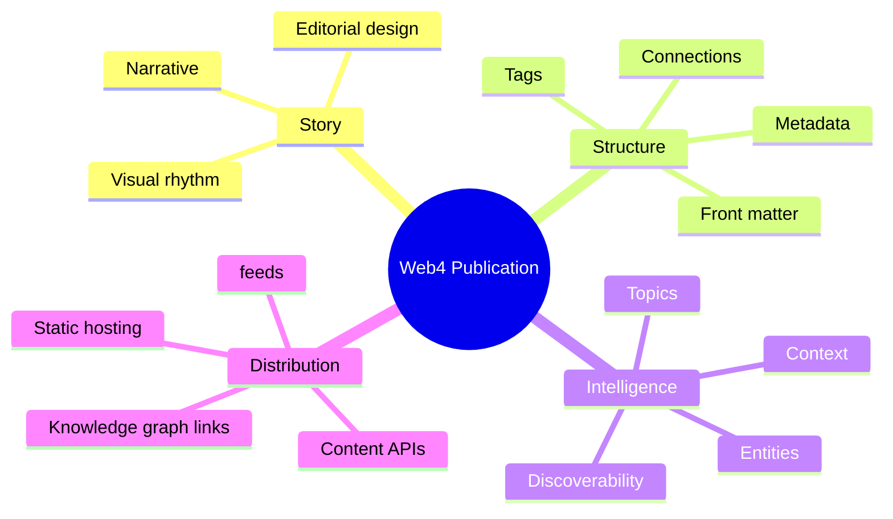

<div align="center">

# Web4 Publisher

### Publish meaning. Design clarity. Connect the web.

A premium semantic publishing engine for the next layer of the internet — built for creators, communities, and knowledge-driven teams.

[**Platform**](#platform) · [**Workflow**](#workflow) · [**Why it matters**](#why-it-matters) · [**Get started**](#get-started)

</div>

<picture>
  <source media="(prefers-color-scheme: dark)" srcset="https://images.unsplash.com/photo-1516321318423-f06f85e504b3?auto=format&fit=crop&w=1800&q=80">
  <source media="(prefers-color-scheme: light)" srcset="https://images.unsplash.com/photo-1516321318423-f06f85e504b3?auto=format&fit=crop&w=1800&q=80">
  
</picture>

> Web4 Publisher transforms content from static output into a living knowledge layer — readable to humans, structured for machines, and ready to connect across the web.

## Platform

Web4 Publisher is designed for the people and teams building the next generation of digital knowledge.

It combines clean editorial publishing, structured metadata, and semantic context so content feels premium, discoverable, and deeply connected rather than isolated and disposable.

<div align="center">

| 🚀 Signal | 🧩 Structure | 🌐 Reach |
|:---:|:---:|:---:|
| Meaning-rich metadata | Clear editorial flow | Static-first deployment |
| Semantic discovery | Premium visual systems | Connected knowledge ecosystems |

</div>

### What it gives you

- Markdown and MDX-first authoring
- Rich semantic metadata and taxonomy
- Beautiful publication layouts
- Searchable context and knowledge relationships
- Open, portable publishing workflows
- Native support for structured digital storytelling

## Workflow


## Why it matters

### 1. Publishing with intent

A publication should not just exist — it should carry meaning, context, and direction.

### 2. Knowledge that compounds

When content is structured correctly, it becomes easier to discover, reference, and build on over time.

### 3. Built for modern ecosystems

Web4 Publisher works with open, portable content patterns and supports the networked nature of the next web.

### 4. Premium by default

Beautiful design, strong hierarchy, and semantic clarity give every publication a more credible and lasting presence.

## Publication model



## Built for creators, communities, and builders

| Capability | Result |
| --- | --- |
| **Semantic architecture** | Content becomes structured and contextual. |
| **Premium design language** | Every publication feels intentional and modern. |
| **Static-first delivery** | Fast, reliable, portable publishing. |
| **Open content model** | Easy to adapt, extend, and repurpose. |
| **Knowledge network thinking** | Publication becomes a system, not a single page. |

## Get started

Start with a simple publication definition:

```yaml
---
title: "My Web4 Publication"
description: "A structured idea ready to be shared."
author: "Your Name"
tags:
  - web4
  - knowledge
  - publishing
draft: false
---
```

Then add your story, references, imagery, and diagrams. The engine helps transform information into a coherent, networked publishing experience.

## Roadmap

- [ ] Semantic publication schema
- [ ] Markdown + MDX publishing pipeline
- [ ] Premium visual themes
- [ ] Entity and topic modeling
- [ ] Static deployment tooling
- [ ] Knowledge graph connectivity

## Build the next layer of publishing

Web4 Publisher is for teams who want to move beyond isolated pages and toward durable, connected, intelligent digital knowledge.

<div align="center">

**Publish with signal. Design with clarity. Connect with the web.**

</div>
