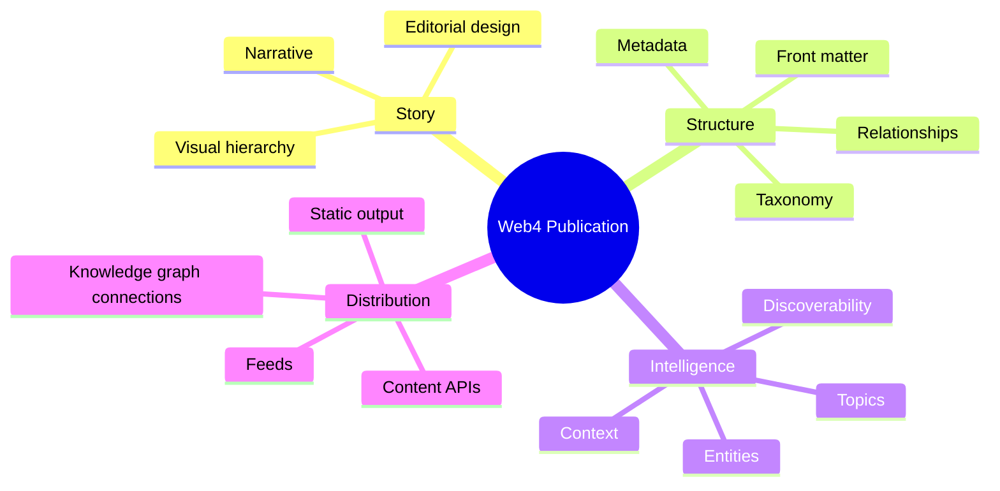

<div align="center">

# Web4 Publisher

### Where publishing becomes infrastructure for meaning.

A premium semantic publishing engine for the next layer of the web — built for authors, communities, and builders who want their ideas to be readable, searchable, and connected.

[**Platform**](#platform) · [**Workflow**](#workflow) · [**Why it matters**](#why-it-matters) · [**Get started**](#get-started)

</div>

<picture>
  <source media="(prefers-color-scheme: dark)" srcset="https://images.unsplash.com/photo-1522202176988-66273c2fd55f?auto=format&fit=crop&w=1800&q=80">
  <source media="(prefers-color-scheme: light)" srcset="https://images.unsplash.com/photo-1522202176988-66273c2fd55f?auto=format&fit=crop&w=1800&q=80">
  
</picture>

> Web4 Publisher helps teams turn content into a living knowledge layer: elegant to read, structured for machines, and connected across the broader web.

## Platform

Web4 Publisher is more than a content tool. It is a publishing system for meaning.

It gives editorial teams a modern way to create, classify, and distribute content with clarity, signal, and structure — while preserving the openness and portability of Markdown-first publishing.

<div align="center">

| Signal | Structure | Scale |
|:---:|:---:|:---:|
| Meaning-rich metadata | Clear editorial workflows | Static-first delivery |
| Semantic discovery | Themeable experiences | Connected knowledge ecosystems |

</div>

### Native to the modern web

- Markdown and MDX-first authoring
- Semantic front matter and metadata
- Open, portable publication formats
- Premium visual systems for storytelling and docs
- Content designed for indexing, linking, and community discovery

## Workflow


## Why it matters

### 1. Editorial elegance

Every publication should feel intentional. Web4 Publisher brings clarity, hierarchy, and visual focus to content without sacrificing flexibility.

### 2. Semantic depth

Instead of isolated text, each post becomes part of a larger information architecture with tags, entities, context, and relationships.

### 3. Open compatibility

The stack stays portable and composable: Markdown-first, static-first, and designed to integrate with modern web systems.

### 4. Networked publishing

The result is content that is easier to discover, connect, and share across communities, tools, and knowledge graphs.

## Publication model



## What a publication can become

| Capability | Outcome |
| --- | --- |
| **Knowledge architecture** | Articles carry meaning, not just text. |
| **Design system** | Publications feel branded and premium. |
| **Runtime flexibility** | Static delivery with extensible publishing workflows. |
| **Semantic indexing** | Better discovery, searchability, and context. |
| **Web4-native framing** | Ideas are connected, contextual, and durable. |

## Get started

Start with a publication definition like this:

```yaml
---
title: "My Web4 Publication"
description: "A structured idea ready to be shared."
author: "Your Name"
tags:
  - web4
  - knowledge
  - publishing
draft: false
---
```

Then add your story, media, references, and diagrams. The engine is designed to help ideas become more visible, more connected, and more valuable over time.

## Roadmap

- [ ] Publication schema and validation
- [ ] Markdown + MDX rendering pipeline
- [ ] Premium visual themes
- [ ] Semantic indexing and linked metadata
- [ ] Relationship modeling for knowledge graphs
- [ ] Static deployment tooling and content distribution

## Build the next layer of publishing

Web4 Publisher is a foundation for creators, researchers, communities, and teams who want to move beyond static pages and toward a more intelligent, connected form of publishing.

<div align="center">

**Publish with signal. Design with clarity. Connect with the web.**

</div>
